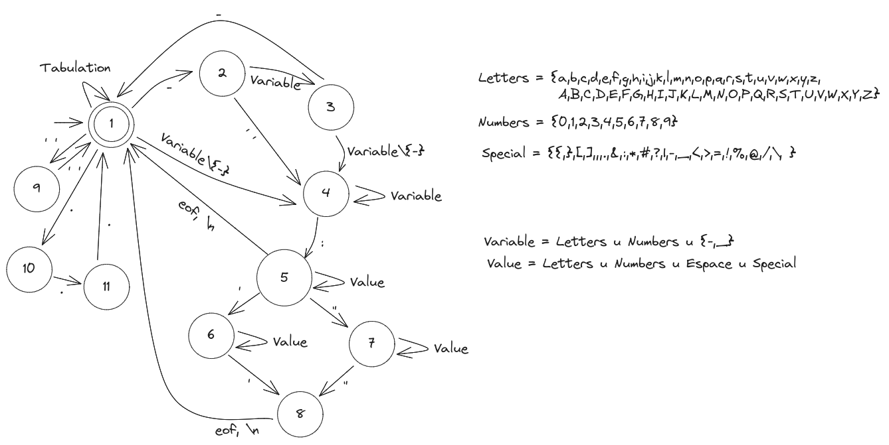
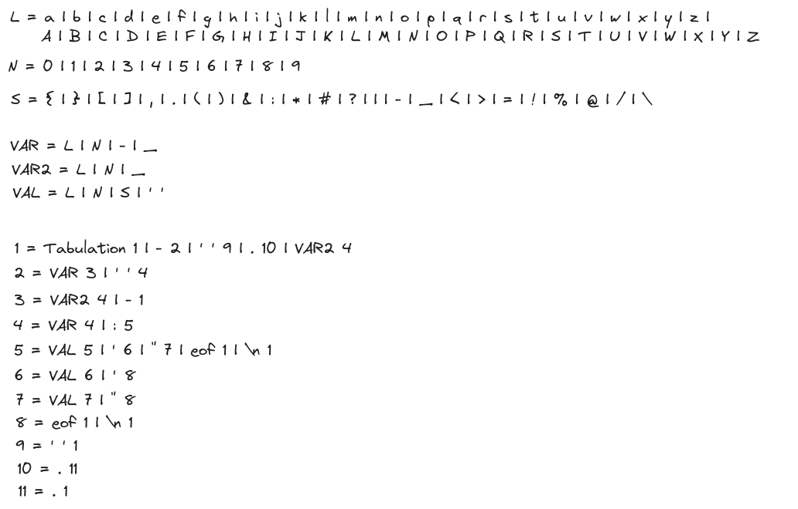

# do4-automate
Ce dépôt contient le script python permettant (normalement) de reconnaître si le contenu d'un fichier est au format YAML.

## Installation
1. Téléchargez le contenu du dépôt
```bash
git clone https://github.com/baptistebronsin/do4-automate.git
```

2. Executez le script
```bash
python3 automate.py
```

## Utilisation
Vous retrouverez un fichier `values.yaml` fourni dans le dépôt. Vous pouvez le modifier pour tester le script.

S'il n'existe pas, le script utilisera le contenu suivant pour son analyse syntaxique :
```yaml
name: John Doe
age: 30
hobbies:
  - Reading
  - Travelling
```

## Fonctionnement
La logique de ce script se base sur la conception d'un automate à états finis déterministe (AFD).

L'état initiale est `1` et le seul état final est aussi `1`.

Depuis cet automate, j'ai définis la grammaire suivante :


## Auteur
Baptiste Bronsin